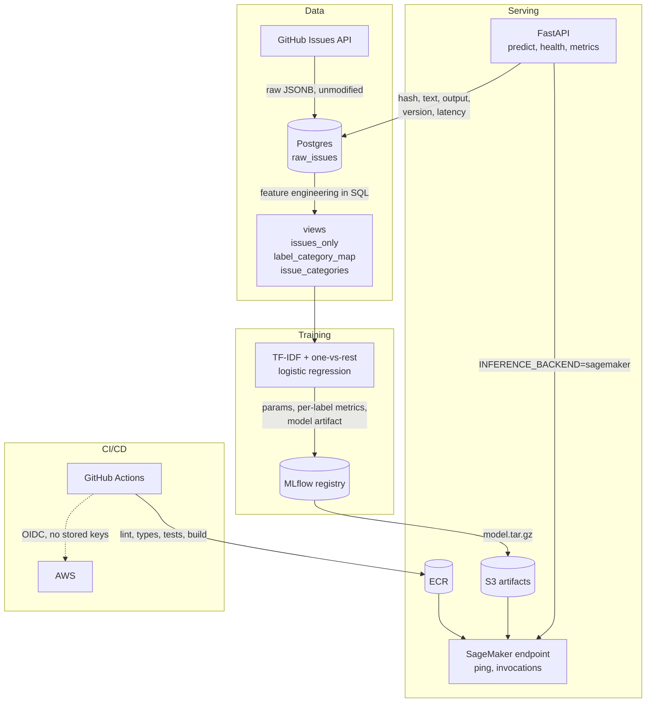

# Ticket Triage

Classifies incoming support tickets into categories — bug, feature, docs,
question, duplicate — so they can be routed without a human reading each one
first. Training data comes from GitHub Issues across four actively-maintained
repos, using maintainer-applied labels as ground truth, which gives a few
hundred thousand real, messily-written tickets that someone already took the
trouble to label.

The engineering around the model is the point here, not the model. What follows
is live data ingestion, reproducible training, a deployed endpoint,
infrastructure as code, CI/CD, and the reasoning behind the choices — including
the ones that went against the obvious answer.

**Status:** Phases 1–6 complete — data, baseline model, service, container and
CI, infrastructure, model comparison. Drift monitoring is deliberately not
built; see the end of this file for why.

Training data: `huggingface/transformers`, `pandas-dev/pandas`,
`scikit-learn/scikit-learn`, `microsoft/vscode` — 467,491 issues ingested.

## Architecture



`INFERENCE_BACKEND` decides where a prediction is computed: in this process
against the registered model, or by calling the deployed endpoint. Either way
the API does the logging, because the endpoint cannot — a model server has no
database to write to. So a prediction served from AWS is recorded exactly like
one served locally, and the deployed path stays observable.

## Results

Both approaches scored on the identical held-out test set — 62,331 issues,
assigned by hashing each issue's identity rather than drawn at random, so the
comparison is like-for-like. Per-label precision and recall stay the primary
reading; macro F1 exists only to give the comparison a single ordering.

| Category | TF-IDF F1 | Embeddings F1 |
|---|---|---|
| bug | **0.566** | 0.508 |
| feature | **0.530** | 0.498 |
| docs | **0.390** | 0.223 |
| question | **0.165** | 0.124 |
| duplicate | **0.294** | 0.268 |
| **macro** | **0.389** | **0.324** |

Baseline detail, TF-IDF with one-vs-rest logistic regression:

| Category | Precision | Recall | Support |
|---|---|---|---|
| bug | 0.447 | 0.772 | 12,148 |
| feature | 0.396 | 0.803 | 7,187 |
| docs | 0.252 | 0.864 | 853 |
| question | 0.095 | 0.631 | 1,690 |
| duplicate | 0.189 | 0.659 | 6,086 |

Recall is strong everywhere and precision is poor everywhere, which is what
`class_weight="balanced"` buys on a linear model: it pushes hard toward catching
positives at the cost of false alarms. `question` is worst by a distance —
"is this a question" is far more semantic than lexical, and TF-IDF sees only
words.

### Word counting beat sentence embeddings

Swapping TF-IDF for `all-MiniLM-L6-v2` embeddings, holding the classifier,
hyperparameters and test split fixed, made every single label worse. Four
plausible causes, roughly in order of suspected weight:

- **Truncation.** MiniLM stops at 256 tokens; the average issue is nearer 440
  tokens' worth, and the 95th percentile far beyond. TF-IDF reads the whole
  document.
- **The task is more lexical than semantic.** "feature request", stack traces
  and "duplicate of #123" are literal string signals, which 20,000 TF-IDF
  features and bigrams capture directly.
- **Compression.** 384 dimensions against 20,000 features discards a lot where
  surface form carries the signal.
- **Domain.** MiniLM is trained on general web text, not developer writing.

The honest caveat: this rests on one comparatively weak encoder. A stronger,
longer-context model (`bge-base-en-v1.5` at 512 tokens) was started and stopped
on cost grounds before producing a number, so "embeddings lose" is better read
as "the cheap embedding approach loses" than as a settled fact.

It is still a useful result. The point of building a documented baseline first
was to make this claim measurable instead of assumed, and the measurement says
the extra machinery did not earn its place.

### On the model that was not fine-tuned

The build order calls for a DistilBERT fine-tune "if the gain justifies it".
The gain from embeddings was negative, and a heavier transformer over the same
truncated inputs has no obvious reason to reverse that, so it was not attempted.
That is the criterion doing its job rather than a step skipped.

## Local setup

From a clean clone:

```bash
cp .env.example .env
```

Fill in `GITHUB_TOKEN` (a personal access token; read-only public scope is
enough), then:

```bash
make install
```

```bash
make up
```

```bash
make ingest
```

Ingestion takes roughly 90 minutes for all four repos and is re-runnable
without duplicates — a second run only fetches what changed. Then:

```bash
make train
```

Model training that needs a GPU runs on AWS rather than locally — embedding the
corpus takes about 40 minutes on an M1 laptop and roughly 12 on a spot GPU, for
about eight cents:

```bash
make export-dataset
```

```bash
make train-cloud
```

```bash
make serve
```

`make test` runs the suite; the integration tests need `make up` first and use a
separate `triage_test` database so they can never touch ingested data.

## AWS and cost

Infrastructure is Terraform, with remote state in S3 and DynamoDB locking.
Everything billable is gated off by default, so an apply made for an unrelated
change provisions nothing:

```bash
make infra-status
```

```bash
make infra-up
```

```bash
make endpoint-up
```

```bash
make infra-down
```

`infra-status` lists anything currently billable alongside month-to-date spend.
RDS runs about $0.02/hour and the SageMaker endpoint about $0.12/hour, so both
are created on demand and destroyed after. A budget alert at $20 is the backstop
for when that discipline fails.

The permanent footprint is a few cents a month: container images in ECR, the
model artifact and Terraform state in S3.

## Decisions

**Feature engineering lives in SQL views, not Python.** `issues_only` filters out
pull requests, `label_category_map` maps each repo's own label vocabulary onto a
shared taxonomy, and `issue_categories` joins them into one row per issue with a
boolean per category. Keeping this in SQL means the training data is defined in
one place that can be queried and inspected directly, rather than reconstructed
by running a script.

**The label map is a curated allowlist, not keyword matching.** Component tags,
workflow labels and engagement labels are deliberately left unmapped. An issue
with none of the category labels becomes a valid all-zero training example — a
real negative — rather than a synthetic "other" class invented by us.

**raw_issues is a single upsert table** keyed on `(repo, issue_number)`, not an
append-only log. Re-ingesting overwrites, which satisfies "re-runnable without
duplicates" directly. The trade-off is that it holds only current label state,
not a history of label changes.

**Ingestion stores the raw API response as-is, pull requests included.** The
issues endpoint returns PRs too, and deciding what counts as a real issue is
feature engineering — so it belongs in a view, not in the ingestion script.

**Prediction logs keep the raw text, not just a hash.** The spec's minimum was a
hash, which is the privacy-conscious default for real customer tickets. These
tickets are already-public GitHub issues, so that argument doesn't apply, and
Phase 7's drift monitoring cannot compare feature distributions against a
one-way hash. Keeping the text now avoids a schema change later that would
leave all earlier predictions useless for comparison.

**The API pins an exact model version** via `MODEL_VERSION` rather than tracking
a "latest" or an MLflow alias. Serving what a config file names is auditable and
reproducible; serving whatever was registered most recently means an untested
training run becomes live on the next restart, with no deploy and no record.

**CI authenticates to AWS through GitHub's OIDC provider**, assuming a role
scoped to `main` on this one repository, so there are no long-lived AWS keys in
repository secrets. This did not work first time: GitHub embeds immutable
numeric owner and repository IDs in the OIDC subject claim
(`repo:owner@186747603/name@1365824571:ref:refs/heads/main`) so that deleting a
repo and recreating it under the same name cannot inherit its trust. CloudTrail
showed the real claim; the policy now accepts both forms.

**The API logs predictions, the endpoint does not.** Giving the model server a
database would put application concerns inside the thing whose only job is
turning text into numbers, so inference is routed through the API instead and
the log covers both paths identically. Verified against a live endpoint: a
prediction served from AWS took 398ms against roughly 8ms in-process — the
round trip — and landed in Postgres with its input text intact.

There is deliberately no fallback between the backends. An unreachable endpoint
surfaces as an error, because quietly answering from a different model than the
caller believes they are using is worse than failing.

**The train/test split is hashed from issue identity, not drawn at random.**
`train_test_split(random_state=...)` fixes which *positions* land in the test
set, and a `SELECT` without `ORDER BY` promises nothing about which row sits at
a given position — so the same seed could quietly evaluate different issues
after a vacuum or a parallel scan. Comparing approaches means the split has to
be pinned to the issues themselves, so it lives in the view as a hash of
`(repo, issue_number)`. New issues land on a side without disturbing existing
ones.

**GPU training runs on SageMaker, not the laptop.** Embedding the corpus takes
about 40 minutes locally on an 8GB M1 and around 12 on a spot GPU for eight
cents, with the machine left usable throughout. Managed spot gave a 67%
discount on the run that produced the numbers above: 331 billable seconds
against 1,002 of wall clock.

**Training dependencies are an optional extra, not runtime ones.** torch and the
transformer weights would add gigabytes to a serving image that only answers
HTTP requests. If an embedding model ever wins on merit, paying that becomes a
deliberate choice.

**No NAT gateway.** It would cost about $32/month for outbound access nothing
here needs. RDS only requires a subnet group spanning two availability zones,
and the SageMaker endpoint isn't VPC-attached because it authenticates by IAM
rather than network position — so it gains nothing from sitting inside the VPC.

**The RDS master password is generated by Terraform**, not stored in tfvars or
Secrets Manager. It ends up in state either way, this requires no manual
handling, and Secrets Manager would add about $0.40/month for a database not
meant to outlive a working session.

**Postgres runs with `statement_timeout` and `temp_file_limit` set.** An
unbounded aggregation query once spilled temp files until the host disk hit
120MB free and the machine crashed. Those two settings make a runaway query fail
loudly with a clear error rather than taking the machine down with it.

**Real-time inference, reluctantly.** Serverless is the better fit — it scales to
zero, so an idle demo endpoint costs nothing — but serverless endpoints cannot
be created in this AWS account. Creation fails with a bare "Request to service
failed", produces no container logs, and fails identically with no model
artifact attached. Ruled out before concluding it was AWS's problem: the image
was pulled from ECR and run exactly as SageMaker runs it and served correctly;
every IAM action simulates as allowed; the manifest is a single amd64 v2
manifest rather than the multi-arch list that breaks some AWS services; quotas
are non-zero; startup takes under two seconds. The same image, artifact and role
then created a real-time endpoint first time and returned correct predictions.

## Not built, deliberately

**Priority and owning-team classification.** The original framing covered
category, priority and team. Only category is built, because GitHub labels give
reliable ground truth for category and nothing equivalent for the other two —
inventing labels for them would produce a model that scores well against its own
assumptions and means nothing.

**A zero-shot LLM comparison arm.** The build order asks for one, measured on
cost per thousand tickets against latency and F1. It needs an API key that
isn't set up, and the question it answers — is training our own model worth it
versus calling someone else's — is worth answering properly or not at all,
rather than with a half-run.

**A DistilBERT fine-tune.** Conditional on embeddings showing promise, which
they didn't. See the results section.

**Drift monitoring.** Not built, and not for lack of time. Drift monitoring
compares live prediction distributions against the training set, and there is
no live traffic to compare: the endpoint is created on demand and destroyed
after, and the prediction log holds three rows, all of them mine. A weekly job
watching an empty table would be decoration.

The groundwork is done rather than skipped. Predictions are logged with their
raw text specifically so distributions can be compared later, the hashed split
means "the training distribution" is a precisely defined set rather than a
moving target, and routing inference through the API means a deployed
prediction is recorded like any other. What is missing is traffic, which is a
reason to wait rather than a thing to fake.

**Continuous accumulation into RDS.** The security group is scoped to a single
IP, so GitHub Actions runners can't reach it, and the instance is destroyed
between sessions. The scheduled ingest workflow runs against a throwaway
container as a regression check that ingestion still works against the live API.

**Authentication on the API.** There's nothing to protect yet and no users. The
SageMaker endpoint is IAM-authenticated by default; the FastAPI service is local
only.

**Historical label-change tracking.** `raw_issues` stores current state only. If
drift monitoring later needs label histories, that's an append-only log added
when it's actually needed.
