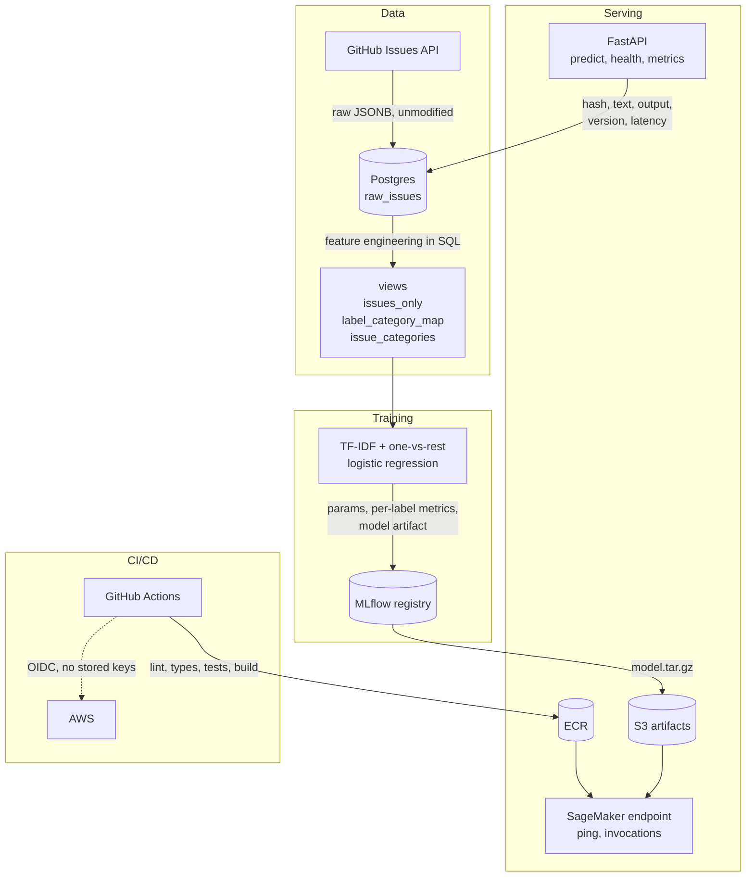

# Ticket Triage

Classifies incoming support tickets into categories — bug, feature, docs,
question, duplicate — so they can be routed without a human reading each one
first. Training data comes from GitHub Issues across four actively-maintained
repos, using maintainer-applied labels as ground truth, which gives a few
hundred thousand real, messily-written tickets that someone already took the
trouble to label.

The engineering around the model is the point here, not the model. What follows
is live data ingestion, reproducible training, a deployed endpoint,
infrastructure as code, CI/CD, and the reasoning behind the choices — including
the ones that went against the obvious answer.

**Status:** Phases 1–5 complete (data, baseline model, service, container/CI,
infrastructure). Phase 6 (better models) and Phase 7 (drift monitoring) not
started.

Training data: `huggingface/transformers`, `pandas-dev/pandas`,
`scikit-learn/scikit-learn`, `microsoft/vscode` — 467,491 issues ingested.

## Architecture



Local development runs the FastAPI service against Postgres and MLflow via
`docker compose`. SageMaker is the deployed artifact and serves inference only —
it has neither a database to log to nor an MLflow server to resolve a registry
URI against.

## Results

Baseline, held-out 20% test split. Per-label precision and recall, never a
single accuracy number: the five categories are independent and unevenly
covered, so one aggregate score would hide more than it shows.

| Category | Precision | Recall | Support |
|---|---|---|---|
| bug | 0.448 | 0.774 | 12,337 |
| feature | 0.387 | 0.792 | 7,244 |
| docs | 0.260 | 0.891 | 865 |
| question | 0.094 | 0.620 | 1,752 |
| duplicate | 0.184 | 0.665 | 6,035 |

Recall is strong everywhere and precision is poor everywhere. That is what
`class_weight="balanced"` buys on a linear model: it pushes hard toward catching
positives at the cost of false alarms. `question` is worst by a distance, which
is unsurprising — "is this a question" is far more semantic than lexical, and
TF-IDF sees only words.

This is a floor to measure against, not a result to defend. It exists so that
Phase 6 can show whether embeddings and a fine-tuned transformer actually earn
their extra cost and complexity, which is a claim you can only make against a
documented baseline.

## Local setup

From a clean clone:

```bash
cp .env.example .env
```

Fill in `GITHUB_TOKEN` (a personal access token; read-only public scope is
enough), then:

```bash
make install
```

```bash
make up
```

```bash
make ingest
```

Ingestion takes roughly 90 minutes for all four repos and is re-runnable
without duplicates — a second run only fetches what changed. Then:

```bash
make train
```

```bash
make serve
```

`make test` runs the suite; the integration tests need `make up` first and use a
separate `triage_test` database so they can never touch ingested data.

## AWS and cost

Infrastructure is Terraform, with remote state in S3 and DynamoDB locking.
Everything billable is gated off by default, so an apply made for an unrelated
change provisions nothing:

```bash
make infra-status
```

```bash
make infra-up
```

```bash
make endpoint-up
```

```bash
make infra-down
```

`infra-status` lists anything currently billable alongside month-to-date spend.
RDS runs about $0.02/hour and the SageMaker endpoint about $0.12/hour, so both
are created on demand and destroyed after. A budget alert at $20 is the backstop
for when that discipline fails.

The permanent footprint is a few cents a month: container images in ECR, the
model artifact and Terraform state in S3.

## Decisions

**Feature engineering lives in SQL views, not Python.** `issues_only` filters out
pull requests, `label_category_map` maps each repo's own label vocabulary onto a
shared taxonomy, and `issue_categories` joins them into one row per issue with a
boolean per category. Keeping this in SQL means the training data is defined in
one place that can be queried and inspected directly, rather than reconstructed
by running a script.

**The label map is a curated allowlist, not keyword matching.** Component tags,
workflow labels and engagement labels are deliberately left unmapped. An issue
with none of the category labels becomes a valid all-zero training example — a
real negative — rather than a synthetic "other" class invented by us.

**raw_issues is a single upsert table** keyed on `(repo, issue_number)`, not an
append-only log. Re-ingesting overwrites, which satisfies "re-runnable without
duplicates" directly. The trade-off is that it holds only current label state,
not a history of label changes.

**Ingestion stores the raw API response as-is, pull requests included.** The
issues endpoint returns PRs too, and deciding what counts as a real issue is
feature engineering — so it belongs in a view, not in the ingestion script.

**Prediction logs keep the raw text, not just a hash.** The spec's minimum was a
hash, which is the privacy-conscious default for real customer tickets. These
tickets are already-public GitHub issues, so that argument doesn't apply, and
Phase 7's drift monitoring cannot compare feature distributions against a
one-way hash. Keeping the text now avoids a schema change later that would
leave all earlier predictions useless for comparison.

**The API pins an exact model version** via `MODEL_VERSION` rather than tracking
a "latest" or an MLflow alias. Serving what a config file names is auditable and
reproducible; serving whatever was registered most recently means an untested
training run becomes live on the next restart, with no deploy and no record.

**CI authenticates to AWS through GitHub's OIDC provider**, assuming a role
scoped to `main` on this one repository, so there are no long-lived AWS keys in
repository secrets. This did not work first time: GitHub embeds immutable
numeric owner and repository IDs in the OIDC subject claim
(`repo:owner@186747603/name@1365824571:ref:refs/heads/main`) so that deleting a
repo and recreating it under the same name cannot inherit its trust. CloudTrail
showed the real claim; the policy now accepts both forms.

**No NAT gateway.** It would cost about $32/month for outbound access nothing
here needs. RDS only requires a subnet group spanning two availability zones,
and the SageMaker endpoint isn't VPC-attached because it authenticates by IAM
rather than network position — so it gains nothing from sitting inside the VPC.

**The RDS master password is generated by Terraform**, not stored in tfvars or
Secrets Manager. It ends up in state either way, this requires no manual
handling, and Secrets Manager would add about $0.40/month for a database not
meant to outlive a working session.

**Postgres runs with `statement_timeout` and `temp_file_limit` set.** An
unbounded aggregation query once spilled temp files until the host disk hit
120MB free and the machine crashed. Those two settings make a runaway query fail
loudly with a clear error rather than taking the machine down with it.

**Real-time inference, reluctantly.** Serverless is the better fit — it scales to
zero, so an idle demo endpoint costs nothing — but serverless endpoints cannot
be created in this AWS account. Creation fails with a bare "Request to service
failed", produces no container logs, and fails identically with no model
artifact attached. Ruled out before concluding it was AWS's problem: the image
was pulled from ECR and run exactly as SageMaker runs it and served correctly;
every IAM action simulates as allowed; the manifest is a single amd64 v2
manifest rather than the multi-arch list that breaks some AWS services; quotas
are non-zero; startup takes under two seconds. The same image, artifact and role
then created a real-time endpoint first time and returned correct predictions.

## Not built, deliberately

**Priority and owning-team classification.** The original framing covered
category, priority and team. Only category is built, because GitHub labels give
reliable ground truth for category and nothing equivalent for the other two —
inventing labels for them would produce a model that scores well against its own
assumptions and means nothing.

**Better models.** Sentence embeddings and a DistilBERT fine-tune are Phase 6.
The point of the baseline is to make that comparison honest rather than
assumed.

**Drift monitoring.** Phase 7. The prediction log already keeps what it needs.

**Continuous accumulation into RDS.** The security group is scoped to a single
IP, so GitHub Actions runners can't reach it, and the instance is destroyed
between sessions. The scheduled ingest workflow runs against a throwaway
container as a regression check that ingestion still works against the live API.

**Authentication on the API.** There's nothing to protect yet and no users. The
SageMaker endpoint is IAM-authenticated by default; the FastAPI service is local
only.

**Historical label-change tracking.** `raw_issues` stores current state only. If
drift monitoring later needs label histories, that's an append-only log added
when it's actually needed.
